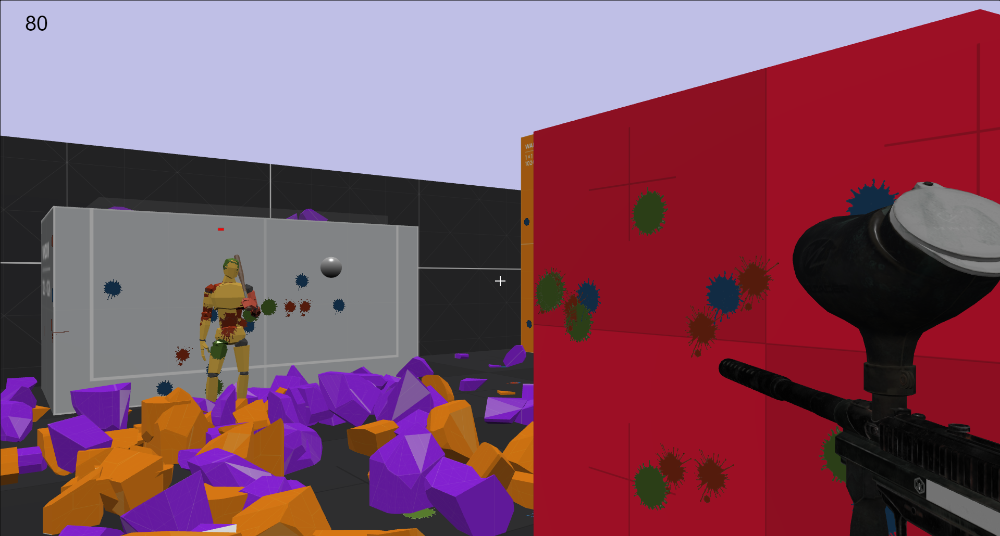

# Paintball Shooter

Paintball Shooter is a simple 3D shooter game with integrated physics like box explosions and objects' collisions. The game was built using [Babylonjs](https://babylonjs.com/). Physics engine is [Cannonjs](https://schteppe.github.io/cannon.js/).



## Installation

Clone the repo, then run the below commands.

```bash
npm install
```

```bash
npm run dev
```

## License

[MIT](https://choosealicense.com/licenses/mit/)
